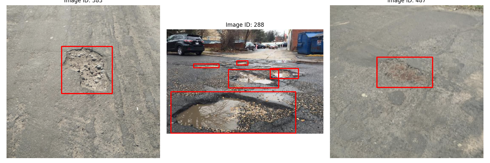

# 路面缺陷检测

本项目使用YOLO模型对道路坑洼等路面缺陷进行检测。



## 文件结构

```
├── dataset/data.yaml  # 数据集配置文件
├── check_data.py      # 检查并可视化数据集
├── train.py           # 模型训练脚本
├── validate.py        # 模型验证脚本
├── predict.py         # 模型推理脚本
└── README.md          # 项目说明
```

## 使用说明

### 1. 数据准备

本项目代码仓库中已经包含了**路面缺陷检测**的部分可用数据集：
- 类别: 坑洼(pothole)
- 类型: YOLO格式
- 位置: `./dataset/`

### 2. 训练模型

以下为使用`yolov8s`为例进行模型训练：
```bash
python train.py --model yolov8s --data pothole_data.yaml --epochs 100 --batch-size 16
```

常用参数:
- `--model`: 选择模型大小 (yolov8n, yolov8s, yolov8m, yolov8l, yolov8x)
- `--epochs`: 训练轮次
- `--batch-size`: 批次大小
- `--imgsz`: 输入图像尺寸
- `--device`: 训练设备 (0, 1, cpu)

### 3. 验证模型

```bash
python validate.py --model runs/pothole_detection/weights/best.pt --data pothole_data.yaml
```

### 4. 使用模型推理

单张图片:
```bash
python predict.py --model runs/pothole_detection/weights/best.pt --source path/to/image.jpg
```

视频:
```bash
python predict.py --model runs/pothole_detection/weights/best.pt --source path/to/video.mp4
```

摄像头:
```bash
python predict.py --model runs/pothole_detection/weights/best.pt --source 0
```

## 模型性能

训练后的模型性能指标将显示在`runs/pothole_detection`目录下。
